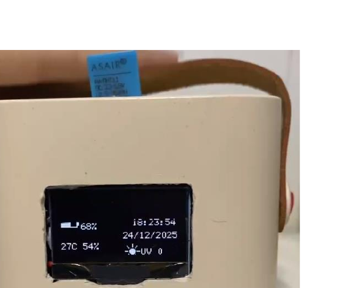
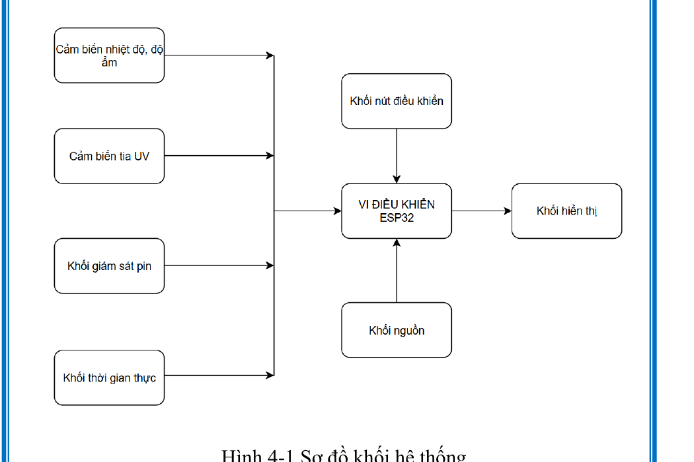
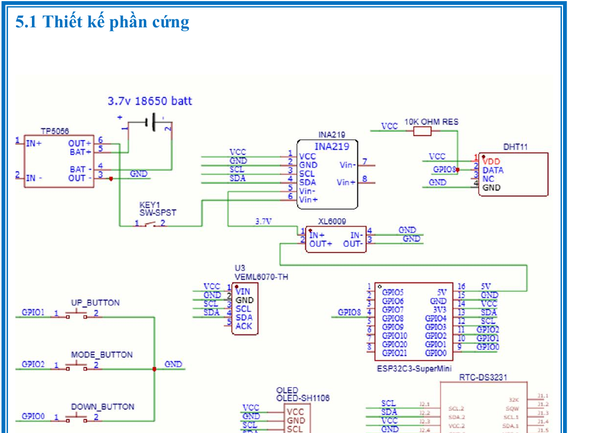
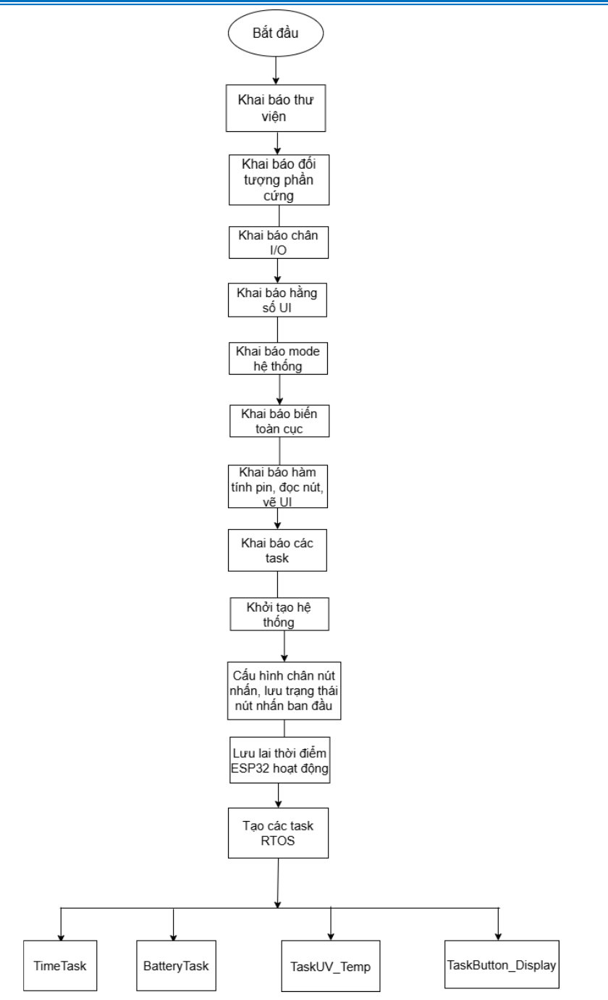
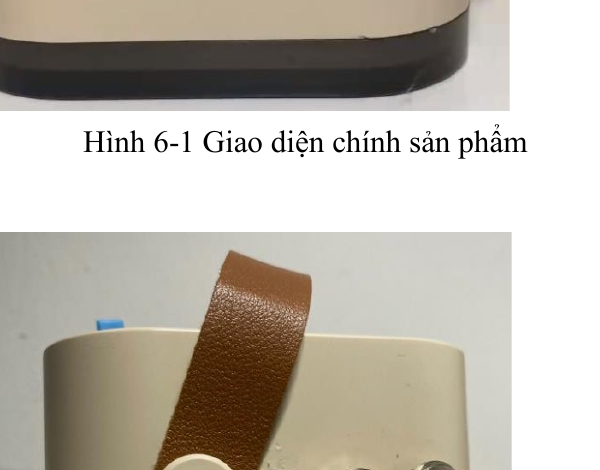
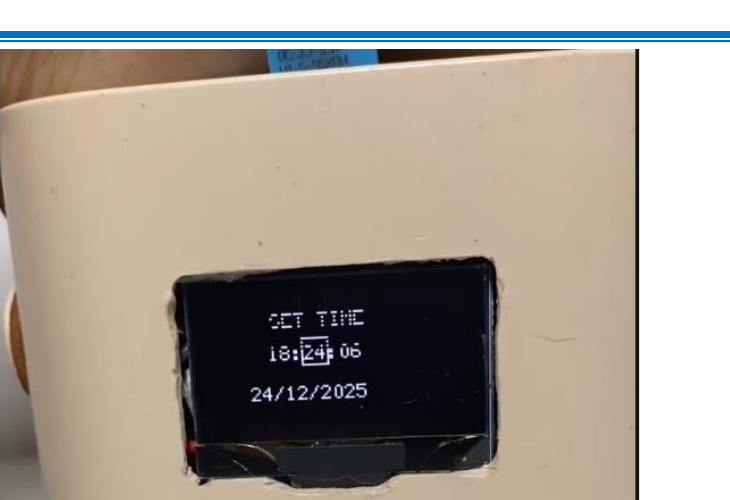

# Đồng hồ để bàn thông minh ESP32-C3 sử dụng FreeRTOS


## 1. Giới thiệu

Đây là dự án đồng hồ để bàn thông minh sử dụng vi điều khiển **ESP32-C3 Super Mini** làm bộ xử lý trung tâm. Thiết bị không chỉ hiển thị thời gian và ngày tháng mà còn thu thập các thông số môi trường gồm nhiệt độ, độ ẩm và cường độ tia UV. Bên cạnh đó, hệ thống sử dụng mạch INA219 để phục vụ việc giám sát nguồn pin, màn hình OLED SH1106 để hiển thị dữ liệu và ba nút nhấn để người dùng điều chỉnh thời gian trực tiếp trên thiết bị.

Phần mềm được tổ chức theo mô hình đa nhiệm bằng **FreeRTOS**. Thay vì xử lý toàn bộ công việc tuần tự trong hàm `loop()`, chương trình chia hệ thống thành các task độc lập để đọc thời gian, đọc cảm biến, xử lý pin và cập nhật giao diện. Cách tổ chức này giúp từng chức năng có chu kỳ hoạt động riêng, làm cho mã nguồn rõ ràng hơn và phù hợp với phương pháp thiết kế hệ thống nhúng thời gian thực.

<p align="center">
  
</p>

## 2. Chức năng của hệ thống

Ở chế độ hoạt động bình thường, thiết bị hiển thị đồng thời giờ, ngày tháng, nhiệt độ, độ ẩm, giá trị UV và phần trăm pin trên màn hình OLED. Dữ liệu thời gian được lấy từ mô-đun RTC DS3231 nên vẫn có thể được duy trì khi nguồn chính của hệ thống bị ngắt, với điều kiện mô-đun RTC có pin dự phòng.

Người dùng có thể nhấn nút `MODE` để chuyển từ giao diện chính sang chế độ cài đặt. Trong chế độ này, nút `MODE` được dùng để lần lượt chọn giờ, phút, giây, ngày, tháng và năm; nút `UP` làm tăng giá trị; còn nút `DOWN` làm giảm giá trị. Khi hoàn tất mục năm và nhấn `MODE` thêm một lần, chương trình ghi thời gian mới vào DS3231 rồi quay trở lại giao diện hiển thị chính.

Hệ thống cũng thu thập nhiệt độ và độ ẩm từ DHT11, đọc cường độ tia UV từ VEML6070 và tổ chức khối giám sát pin bằng INA219. Các dữ liệu được lưu trong những biến dùng chung để task giao diện có thể đọc và hiển thị theo chu kỳ.

## 3. Kiến trúc tổng thể

ESP32-C3 là trung tâm của toàn bộ hệ thống. Khối thời gian thực, khối cảm biến UV, khối giám sát pin và màn hình OLED giao tiếp với ESP32-C3 qua bus I2C; cảm biến DHT11 truyền dữ liệu qua một chân GPIO riêng; ba nút nhấn được nối vào các chân vào số và xử lý bằng ngắt ngoài. Sau khi nhận dữ liệu, ESP32-C3 thực hiện kiểm tra, xử lý và định dạng trước khi hiển thị lên OLED.

<p align="center">
  
</p>

Khối nguồn sử dụng pin Li-ion 18650, mạch TP4056 để sạc pin và mô-đun XL6009 để nâng điện áp. Cách bố trí này cho phép thiết bị hoạt động độc lập bằng pin thay vì phải kết nối nguồn USB liên tục.

## 4. Thiết kế phần cứng

Sơ đồ nguyên lý dưới đây mô tả kết nối giữa ESP32-C3, DS3231, INA219, VEML6070, DHT11, OLED SH1106, các nút nhấn và khối nguồn. Hình được trích từ tài liệu thiết kế của dự án và có vai trò minh họa kiến trúc phần cứng tổng quát.

<p align="center">
  
</p>

Trong phiên bản mã nguồn hiện tại, bus I2C được khởi tạo bằng `Wire.begin(4, 3)`, nghĩa là SDA sử dụng GPIO4 và SCL sử dụng GPIO3. DHT11 được khai báo tại GPIO8; ba nút `MODE`, `UP` và `DOWN` lần lượt sử dụng GPIO2, GPIO1 và GPIO0. Khi lắp mạch thực tế, nên ưu tiên đối chiếu với các hằng số trong file `.ino`, vì sơ đồ trong báo cáo có thể thuộc phiên bản đấu nối trước đó.

| Thành phần | Chân hoặc giao tiếp trong mã nguồn |
|---|---|
| OLED SH1106 | I2C, dùng chung SDA GPIO4 và SCL GPIO3 |
| RTC DS3231 | I2C, dùng chung SDA GPIO4 và SCL GPIO3 |
| INA219 | I2C, dùng chung SDA GPIO4 và SCL GPIO3 |
| VEML6070 | I2C, dùng chung SDA GPIO4 và SCL GPIO3 |
| DHT11 | GPIO8 |
| Nút MODE | GPIO2, `INPUT_PULLUP`, ngắt cạnh xuống |
| Nút UP | GPIO1, `INPUT_PULLUP`, ngắt cạnh xuống |
| Nút DOWN | GPIO0, `INPUT_PULLUP`, ngắt cạnh xuống |

## 5. Kiến trúc phần mềm FreeRTOS

Sau khi ESP32-C3 khởi động, hàm `setup()` cấu hình Serial, chân nút nhấn, ngắt ngoài, bus I2C và màn hình OLED. Tiếp theo, chương trình tạo bốn task FreeRTOS. Hàm `loop()` được để trống vì toàn bộ hoạt động chính đã được chuyển sang các task chạy song song dưới sự điều phối của FreeRTOS.

<p align="center">
  
</p>

| Task | Chức năng | Chu kỳ xử lý | Priority | Stack |
|---|---|---:|---:|---:|
| `TimeTask` | Đọc giờ và ngày tháng từ DS3231 | 1000 ms | 1 | 4096 |
| `BatteryTask` | Xử lý dữ liệu và phần trăm pin | 2000 ms | 1 | 4096 |
| `EnvTask` | Đọc UV, nhiệt độ và độ ẩm | 2000 ms | 1 | 4096 |
| `UiTask` | Xử lý nút nhấn và cập nhật OLED | 200 ms | 2 | 4096 |

### `TimeTask`

`TimeTask` khởi tạo RTC bằng `rtc.begin()` rồi chạy trong một vòng lặp vô hạn. Khi hệ thống đang ở `MODE_NORMAL`, task đọc thời gian hiện tại từ DS3231, định dạng giờ thành chuỗi `HH:MM:SS` và ngày tháng thành chuỗi `DD/MM/YYYY`. Trong lúc người dùng đang chỉnh thời gian, task tạm dừng việc đọc RTC để tránh ghi đè các giá trị cài đặt đang được thay đổi. Sau mỗi vòng xử lý, task gọi `vTaskDelay()` trong 1000 ms.

### `BatteryTask`

`BatteryTask` khởi tạo INA219 và định kỳ chuyển đổi điện áp pin thành phần trăm bằng hàm `calcBatteryPercent()`. Hàm này quy ước điện áp 4,2 V tương ứng 100% và 3,2 V tương ứng 0%, còn các giá trị ở giữa được nội suy tuyến tính.

Trong mã nguồn hiện tại, biến `batteryVoltage` chưa được cập nhật bằng lệnh đọc INA219 nên phần trăm pin có thể luôn bằng 0. Để hoàn thiện chức năng, cần bổ sung việc đọc điện áp trong vòng lặp của `BatteryTask`, chẳng hạn:

```cpp
batteryVoltage = ina219.getBusVoltage_V();
batteryPercent = calcBatteryPercent(batteryVoltage);
```

### `EnvTask`

`EnvTask` khởi tạo cảm biến VEML6070 và DHT11. Trong mỗi chu kỳ, task đọc giá trị UV bằng `uv.readUV()`, sau đó đọc độ ẩm và nhiệt độ từ DHT11. Chương trình dùng `isnan()` để kiểm tra dữ liệu DHT11; chỉ khi cả hai giá trị hợp lệ thì biến dùng chung mới được cập nhật. Task lặp lại quá trình này sau mỗi 2000 ms.

### `UiTask`

`UiTask` đảm nhiệm cả xử lý nút nhấn lẫn vẽ giao diện OLED. Đây là task có priority bằng 2, cao hơn ba task thu thập dữ liệu, nhằm giúp giao diện và thao tác người dùng phản hồi nhanh hơn. Ba hàm ngắt chỉ đặt các cờ `evtMode`, `evtUp` và `evtDown`; phần xử lý chính được thực hiện trong task, nhờ đó tránh đưa các thao tác phức tạp vào ISR.

Ở chế độ bình thường, task vẽ biểu tượng pin, phần trăm pin, thời gian, ngày tháng, nhiệt độ, độ ẩm và UV. Khi chuyển sang chế độ cài đặt, task hiển thị các giá trị thời gian đang chỉnh và vẽ khung quanh trường hiện được chọn. Sau mỗi lần cập nhật, nội dung được gửi từ buffer ra OLED bằng `u8g2.sendBuffer()`, rồi task tạm dừng 200 ms.

## 6. Luồng hoạt động

Khi được cấp nguồn hoặc reset, ESP32-C3 khởi tạo các thư viện, giao tiếp ngoại vi và đối tượng phần cứng. Sau đó chương trình cấu hình ba nút nhấn ở chế độ `INPUT_PULLUP`, gắn ngắt cạnh xuống và tạo bốn task FreeRTOS. `TimeTask` cập nhật thời gian mỗi giây; `EnvTask` và `BatteryTask` xử lý dữ liệu cảm biến theo chu kỳ hai giây; `UiTask` cập nhật màn hình và kiểm tra các cờ nút nhấn mỗi 200 ms.

Dữ liệu do các task cảm biến thu thập được lưu trong các biến toàn cục. `UiTask` sử dụng các biến này để tạo giao diện hiển thị. Khi người dùng nhấn nút, ISR tương ứng chỉ ghi nhận sự kiện, sau đó `UiTask` thay đổi trạng thái giao diện và cập nhật dữ liệu cài đặt. Cách xử lý này giúp thời gian thực thi của ISR ngắn và giảm nguy cơ làm gián đoạn các task khác.

## 7. Giao diện sản phẩm

Giao diện chính tập trung toàn bộ thông tin quan trọng trên màn hình OLED 128 × 64 pixel. Phía trái hiển thị trạng thái pin, nhiệt độ và độ ẩm; phía phải hiển thị giờ, ngày tháng và chỉ số UV. Hai hàm `drawBatteryIcon()` và `drawSunIcon()` được sử dụng để tạo biểu tượng trực tiếp bằng các lệnh đồ họa của thư viện U8g2.

<table>
  <tr>
    <td align="center"></td>
    <td align="center"></td>
  </tr>
  <tr>
    <td align="center"><b>Giao diện hiển thị chính</b></td>
    <td align="center"><b>Cụm nút điều khiển</b></td>
  </tr>
</table>

Khi chuyển sang chế độ cài đặt, màn hình hiển thị dòng `SET TIME`, giờ ở hàng trên và ngày tháng ở hàng dưới. Khung chữ nhật cho biết trường dữ liệu đang được chọn, giúp người dùng nhận biết nút `UP` hoặc `DOWN` sẽ tác động lên giá trị nào.

<p align="center">
  
</p>

## 8. Linh kiện chính

| Linh kiện | Vai trò trong hệ thống |
|---|---|
| ESP32-C3 Super Mini | Bộ xử lý trung tâm và thực thi các task FreeRTOS |
| DS3231 | Cung cấp thời gian thực và duy trì thời gian bằng pin dự phòng |
| DHT11 | Đo nhiệt độ và độ ẩm môi trường |
| VEML6070 | Đo cường độ tia UV |
| INA219 | Đo điện áp, dòng điện và hỗ trợ giám sát pin |
| OLED SH1106 1.3 inch | Hiển thị giao diện và dữ liệu cảm biến |
| TP4056 | Sạc pin Li-ion theo cơ chế CC/CV |
| XL6009 | Nâng và ổn định điện áp nguồn |
| Ba nút nhấn | Chuyển chế độ và thay đổi giá trị thời gian |

## 9. Thư viện sử dụng

Mã nguồn được viết theo Arduino framework và sử dụng các thư viện `Wire`, `U8g2lib`, `Adafruit_INA219`, `Adafruit_VEML6070`, `RTClib`, `DHT` và `math.h`. FreeRTOS đã được tích hợp trong Arduino Core dành cho ESP32 nên chương trình có thể gọi trực tiếp các hàm như `xTaskCreate()`, `vTaskDelay()` và `pdMS_TO_TICKS()` mà không cần cài một hệ điều hành riêng.

## 10. Cấu trúc thư mục

```text
ESP32_SmartClock_FreeRTOS/
├── ESP32_SmartClock_FreeRTOS.ino
├── README.md
└── docs/
    ├── system_architecture.png
    ├── hardware_schematic.png
    ├── software_flowchart.png
    ├── product_main.png
    ├── control_buttons.png
    └── time_setting_ui.png
```

File chương trình chính sử dụng đuôi **`.ino`** vì dự án được biên dịch bằng Arduino IDE. Tên file chính nên trùng với tên thư mục sketch, do đó cấu trúc phù hợp là thư mục `ESP32_SmartClock_FreeRTOS` chứa file `ESP32_SmartClock_FreeRTOS.ino`. Nếu cần chia nhỏ mã nguồn trong tương lai, các phần khai báo có thể đặt trong file `.h`, còn phần cài đặt hàm có thể đặt trong file `.cpp`.

## 11. Hướng dẫn biên dịch và nạp chương trình

Trước tiên, cài Arduino IDE và Arduino Core cho ESP32. Sau đó cài các thư viện U8g2, Adafruit INA219, Adafruit VEML6070, RTClib và DHT Sensor Library bằng Library Manager. Mở file `ESP32_SmartClock_FreeRTOS.ino`, chọn board tương thích với ESP32-C3 Super Mini, chọn đúng cổng COM rồi thực hiện Verify và Upload.

Sau khi nạp chương trình, mở Serial Monitor ở tốc độ 115200 baud để theo dõi quá trình khởi động nếu cần. Thiết bị sẽ tự tạo các task FreeRTOS trong `setup()` và bắt đầu cập nhật màn hình; vì vậy việc hàm `loop()` không chứa lệnh nào là chủ ý thiết kế, không phải lỗi chương trình.

## 12. Hướng phát triển

Dự án có thể được mở rộng bằng cách đồng bộ thời gian qua NTP khi có Wi-Fi, lưu dữ liệu cảm biến theo thời gian, gửi dữ liệu lên MQTT hoặc một nền tảng IoT, bổ sung chế độ ngủ tiết kiệm năng lượng và cải thiện thuật toán ước lượng dung lượng pin dựa trên đặc tuyến xả thực tế thay vì nội suy tuyến tính đơn giản.

## 13. Ghi chú

Dự án được xây dựng cho mục đích học tập về ESP32-C3, giao tiếp cảm biến, thiết kế giao diện OLED, xử lý ngắt và tổ chức phần mềm đa nhiệm bằng FreeRTOS. Trước khi lắp mạch hoặc cấp nguồn, cần kiểm tra lại điện áp hoạt động, chân kết nối và mức logic của từng mô-đun để tránh làm hỏng linh kiện.
